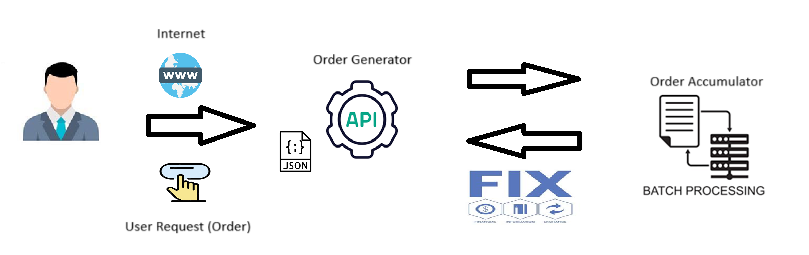

# OrderGenerator e OrderAccumulator

Este projeto consiste em duas aplicações C# que se comunicam usando o protocolo FIX versão 4.4 (QuickFix). A primeira aplicação, **OrderGenerator**, é responsável por gerar ordens, enquanto a segunda aplicação, **OrderAccumulator**, recebe as ordens e calcula a exposição financeira por símbolo.

## Aplicações

### 1. **OrderGenerator**
O **OrderGenerator** deve apresentar um formulário numa página web com os seguintes campos para a criação de uma nova ordem do tipo `NewOrderSingle`:

- **Símbolo**: Escolhido entre PETR4, VALE3 ou VIIA4.
- **Lado**: Escolhido entre **Compra** ou **Venda**.
- **Quantidade**: Valor inteiro positivo menor que 100.000.
- **Preço**: Valor decimal positivo, múltiplo de 0.01 e menor que 1.000.

Após o preenchimento do formulário, a aplicação deverá apresentar a resposta da requisição.

### 2. **OrderAccumulator**
O **OrderAccumulator** recebe as ordens e calcula a exposição financeira por símbolo. A fórmula para o cálculo da exposição financeira é:

Exposição financeira = somatório de (preço * quantidade executada) de cada ordem de compra - somatório de (preço * quantidade executada) de cada ordem de venda

Ou seja, as ordens de **compra** aumentam a exposição, enquanto as ordens de **venda** diminuem a exposição.

A figura a seguir mostra a arquitetura em alto nível da aplicação: 

#### Regras do OrderAccumulator:
- O **OrderAccumulator** possui um limite interno de R$ 100.000.000 (cem milhões) por símbolo.
- Se uma ordem ultrapassar esse limite em valor absoluto, a ordem deve ser rejeitada.
- Se a ordem for aceita, o **OrderAccumulator** deve responder com um `ExecutionReport` tendo `ExecType = New` e a ordem será considerada no cálculo de exposição.
- Se a ordem for rejeitada, o **OrderAccumulator** deve responder com um `ExecutionReport` tendo `ExecType = Rejected` e a ordem não será considerada no cálculo de exposição.

---

## Regras de Negócio

### 1. **Criar uma nova ordem**

**Objetivo:** O sistema deve permitir que um usuário crie uma nova ordem.

- **Quando** o usuário preenche o formulário de criação de uma ordem com as informações corretas:
  - **Símbolo**: O usuário escolhe entre os símbolos **PETR4**, **VALE3**, ou **VIIA4**.
  - **Lado**: O usuário escolhe entre **Compra** ou **Venda**.
  - **Quantidade**: O usuário informa um valor inteiro positivo menor que 100.000.
  - **Preço**: O usuário informa um valor decimal positivo, múltiplo de 0.01 e menor que 1.000.
  
- **Então** quando o usuário submeter a ordem:
  - Se os dados da ordem estiverem corretos, a ordem será aceita e o sistema responderá confirmando a criação da ordem.
  - O sistema deve criar um **ExecutionReport** com o tipo de execução **"New"** para indicar que a ordem foi aceita.

- **Quando** o usuário preenche o formulário com uma quantidade maior que 100.000:
  - O sistema deve **rejeitar** a ordem e não permitir que ela seja criada.
  - O sistema deve criar um **ExecutionReport** com o tipo de execução **"Rejected"** para indicar que a ordem foi rejeitada.

- **Quando** o usuário preenche o formulário com um preço maior que 1.000:
  - O sistema deve **rejeitar** a ordem e não permitir que ela seja criada.
  - O sistema deve criar um **ExecutionReport** com o tipo de execução **"Rejected"** para indicar que a ordem foi rejeitada.

---

### 2. **Processar ordens no OrderAccumulator**

**Objetivo:** O sistema deve processar as ordens recebidas, calculando a **exposição financeira** para cada símbolo e garantir que o limite de exposição não seja ultrapassado.

- **Quando** o sistema recebe uma ordem de **compra**:
  - O sistema deve calcular a **exposição financeira** para o símbolo com base no preço e quantidade da ordem de compra. 
  - As ordens de **compra** aumentam a exposição financeira.
  - O sistema deve criar um **ExecutionReport** com o tipo de execução **"New"** para indicar que a ordem foi aceita e registrada no cálculo da exposição.

- **Quando** o sistema recebe uma ordem de **venda**:
  - O sistema deve calcular a **exposição financeira** para o símbolo com base no preço e quantidade da ordem de venda.
  - As ordens de **venda** diminuem a exposição financeira.
  - O sistema deve criar um **ExecutionReport** com o tipo de execução **"New"** para indicar que a ordem foi aceita e registrada no cálculo da exposição.

- **Quando** a exposição financeira de um símbolo atinge o limite de R$ 100.000.000 (cem milhões):
  - O sistema **não deve aceitar mais ordens** que façam a exposição ultrapassar esse limite.
  - Se uma ordem tentar ultrapassar o limite de exposição:
    - O sistema deve **rejeitar** essa ordem.
    - O sistema deve criar um **ExecutionReport** com o tipo de execução **"Rejected"** para indicar que a ordem foi rejeitada e não foi considerada no cálculo da exposição.

---

### 3. **Rejeitar ordens que ultrapassam o limite de exposição**

**Objetivo:** O sistema deve rejeitar qualquer ordem que, ao ser processada, ultrapasse o limite de exposição financeira de R$ 100.000.000 por símbolo.

- **Quando** o sistema já tem uma exposição financeira de R$ 99.000.000 para o símbolo **PETR4** e uma nova ordem de **compra** de **R$ 2.000.000** é recebida:
  - O sistema deve **rejeitar** a ordem, pois a exposição total ultrapassaria o limite de R$ 100.000.000.
  - O sistema deve criar um **ExecutionReport** com o tipo de execução **"Rejected"** para indicar que a ordem foi rejeitada.

- **Quando** o sistema já tem uma exposição financeira de **R$ 100.000.000** ou mais para um símbolo e uma nova ordem de **compra** ou **venda** é recebida:
  - O sistema deve **rejeitar** a ordem imediatamente, sem permitir que ela seja considerada.
  - O sistema deve criar um **ExecutionReport** com o tipo de execução **"Rejected"** para indicar que a ordem foi rejeitada.

---

## Requisitos

- **Linguagem**: C# (.Net Framework 8).
- **Protocolo**: FIX versão 4.4 (QuickFix).
- **Biblioteca**: [QuickFix.NET](https://quickfixn.org/) & [Logging](https://www.nuget.org/packages/microsoft.extensions.logging/) 
- **Frontend**: HTML + JS + CSS

## Como Executar na Estação de Trabalho

### 1. **OrderGenerator**
1. Clone o repositório.
2. Certifique-se que a biblioteca QuickFix/n esteja em seu projeto, assim como a biblioteca Microsoft Extensions Logging.
3. Ao adicionar a biblioteca, uma série de arquivos são incorporados ao teu projeto, organizados na pasta quickfixn-v1.13.0.
4. Certifique-se que a pasta quickfixn-v1.13.0 esteja na raíz do projeto, no mesmo nível das pastas "OrderGenerator" e "OrderAccumulator"
5. Abra a solução em sua IDE de Preferência.
6. Compile e execute a aplicação.

### 2. **OrderAccumulator**
7. Abra a solução em sua IDE de Preferência.
8. Ao realizar os passos 2 a 4, não será necessário repetir. Vale ressaltar que "OrderAccumulator" também depende da biblioteca QuickFix/n e da Microsoft Extensions Logging.
9. Abra a solução em sua IDE de Preferência.
10. Compile e execute a aplicação.

### 2. **FrontEnd**
11. Clique na página index-html, incorporada a este projeto.
12. Certifique-se que as duas aplicações ("OrderGenerator" e "OrderAccumulator") estejam em execução.
13. Preencha os campos corretamente.
14. Clique em "Criar Order".
15. Confira o resultado.

---
